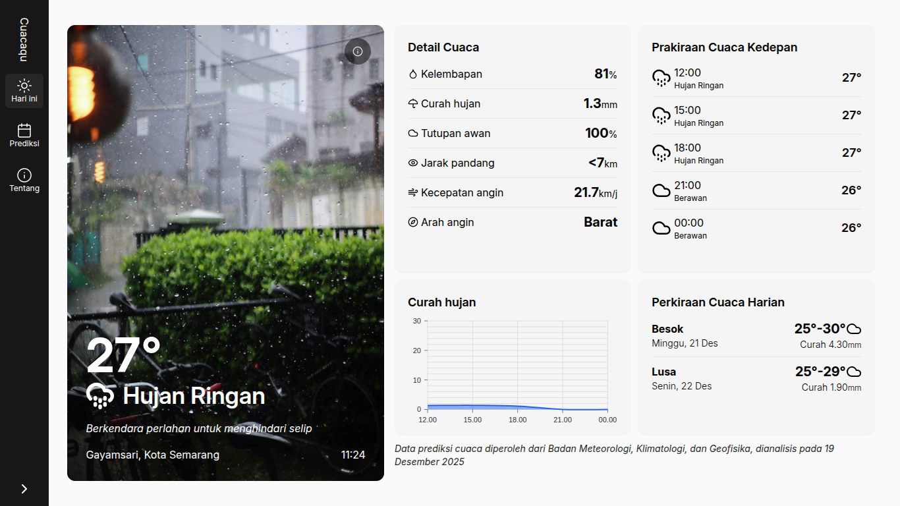

# Cuacaqu

Cuacaqu adalah sebuah aplikasi web prediksi cuaca yang dirancang untuk memberikan informasi cuaca yang akurat, cepat, dan mudah dipahami. Aplikasi ini memanfaatkan API Data Prakiraan Cuaca Terbuka BMKG untuk menyediakan data cuaca real-time dan terpercaya, serta menggunakan API Data Wilayah Administrasi Pemerintahan di Indonesia  untuk menghadirkan daftar wilayah hingga level desa secara lengkap. Dengan tampilan modern serta navigasi yang sederhana, Cuacaqu membantu pengguna mengetahui kondisi cuaca di lokasi mana pun di Indonesia, termasuk hingga ke tingkat desa.

Dibangun menggunakan Node.js, Express.js, dan React.js, Cuacaqu menawarkan performa tinggi sekaligus pengalaman pengguna yang mulus dan responsif. Aplikasi ini juga memanfaatkan paket ikon Lucide  sehingga tampilan icon menjadi lebih bersih, konsisten, dan profesional. Halaman “Cuaca Hari Ini” menyajikan detail kondisi saat ini seperti suhu, kelembapan, curah hujan, kecepatan angin, serta informasi visual yang mudah dipahami. Sementara itu, halaman “Prediksi Cuaca” menampilkan prakiraan kondisi untuk 2–3 hari ke depan, membantu pengguna merencanakan aktivitas harian secara lebih aman dan nyaman.

---

Cuacaqu is a weather prediction web application designed to provide accurate, fast, and easy-to-understand weather information. This application utilizes the BMKG Open Weather Forecast API to provide real-time and reliable weather data, as well as the Indonesian Government Administrative Region Data API to provide a complete list of regions down to the village level. With a modern look and simple navigation, Cuacaqu helps users find out the weather conditions in any location in Indonesia, including down to the village level.

Built using Node.js, Express.js, and React.js, Cuacaqu offers high performance, smooth, and responsive user experience. The application also utilizes the Lucide icon pack for a cleaner, more consistent, and professional look. The “Cuaca Hari Ini” page provides details on current conditions such as temperature, humidity, rainfall, wind speed, and easy-to-understand visual information. Meanwhile, the “Prediksi Cuaca” page displays predictions for the next 2–3 days, helping users plan their daily activities more safely and comfortably.